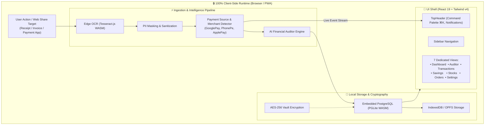

# 🛡️ VaultAudit AI v2.0

<div align="center">


**Your On-Device, Privacy-First Financial Intelligence & Live Payment Auditor**

[](https://react.dev/)
[](https://vitejs.dev/)
[](https://tailwindcss.com/)
[](https://pglite.dev/)
[](https://tesseract.projectnaptha.com/)
[](https://web.dev/progressive-web-apps/)
[](#-privacy--security-guarantees)

[Features](#-key-features) • [Architecture](#-architecture--data-flow) • [Tech Stack](#-tech-stack) • [Quick Start](#-quick-start) • [Security](#-privacy--security-guarantees)

</div>

---

## 🌟 Overview

**VaultAudit AI** is a next-generation, local-first personal financial operating system. Built with an uncompromising commitment to privacy, VaultAudit operates **100% on-device**—meaning zero financial data, bank credentials, receipts, or OCR text ever leave your browser or computer.

Powered by an embedded **PostgreSQL WebAssembly (PGLite)** database, on-device **Tesseract.js OCR**, and an intelligent client-side auditor, VaultAudit provides institutional-grade expense tracking, receipt extraction, investment monitoring, and anomaly detection wrapped in a state-of-the-art **dark glassmorphism** UI.

---

## ✨ Key Features

### ⚡ Live Payment Interception & Web Share Target
- **Direct App Capture**: Share payment receipts or screenshots directly from **GooglePay, ApplePay, PhonePe, Paytm**, or banking apps via the native Web Share API target (`share_target`).
- **Instant Processing**: Real-time OCR parsing extracts merchant names, timestamps, currency symbols, and transaction amounts.
- **Smart Categorization & Toast**: Auto-classifies payments into Dining, Transport, Groceries, Shopping, Utilities, Housing, and triggers a real-time reactive toast notification.

### 📄 Edge OCR & Receipt Ingestion (Tesseract.js v5)
- **Zero-Cloud Optical Recognition**: Extracts text directly inside WebAssembly workers with live progress indicators and a laser-scanning animation.
- **Auto-PII Sanitization**: Masks sensitive card numbers, phone numbers, and personal identifiers before committing to the ledger.
- **Drag-and-Drop Dropzone**: Effortlessly drop receipts, invoices, and billing slips.

### 🧠 On-Device AI Auditor
- **Anomaly Detection**: Flags sudden surges in spending, recurring subscription price hikes, and duplicate charges.
- **Cash Flow Health**: Computes real-time savings runways, burn rate alerts, and monthly budget pacing.
- **Interactive Insights**: Actionable audit feeds with categorization recommendations and confidence ratings.

### 📊 Multi-Range Portfolio & Stocks Tracker
- **Dynamic Time-Series Curves**: Switch between **7D, 30D, 90D, and 1Y** timeframes with smooth interactive area charts powered by Recharts.
- **Synchronized Holdings**: Real-time position tables (AAPL, NVDA, TSLA, MSFT, AMZN, GOOGL) and sector allocation breakdowns that adapt dynamically to the selected time horizon.
- **Trend-Adaptive Visuals**: Smooth color transitions reflecting positive (emerald) and negative (rose) returns.

### 🎯 Interactive Savings Goals
- **Goal Builder**: Create custom financial milestones with target amounts, current savings, customizable icons (9 options), and vibrant color accents (6 themes).
- **In-Place Goal Management**: Edit, update, or delete existing goals seamlessly with live progress rings and completion percentages.
- **Milestone Timeline**: Monthly goal fulfillment trajectories.

### 📦 E-Commerce Invoice OCR & Verification
- **Digital Invoice Parsing**: Specifically tailored for Amazon, Flipkart, Myntra, BestBuy, and Kindle invoices.
- **Verification Workflow**: Mark items as verified to build trust in your ledger; edit extracted items, retailers, and prices directly.

### ⌨️ Universal Command Palette (`⌘K` / `Ctrl+K`)
- **Global Search**: Instantly query across pages, ledger transactions, stock tickers, and rapid actions.
- **Keyboard-First Navigation**: Seamless navigation with hotkeys and quick action triggers.

### ⚙️ Vault Settings & Local Cryptography
- **AES-256 Encryption at Rest**: Encrypt the entire database with a client-side master passphrase.
- **Master Key Rotation**: Re-encrypt local storage on demand.
- **AI Model Cache Management**: Inspect and manage local WASM model storage.
- **Encrypted Vault Export**: Download encrypted `.vault` JSON bundles for offline, sovereign backups.

---

## 🏗️ Architecture & Data Flow



---

## 💻 Tech Stack

| Domain | Technology | Description |
|---|---|---|
| **Framework** | [React 19](https://react.dev/) | High-performance modern component architecture |
| **Build Tool** | [Vite 6](https://vitejs.dev/) | Lightning-fast HMR and optimized production bundles |
| **Styling** | [Tailwind CSS v4](https://tailwindcss.com/) | Modern CSS design tokens, custom OKLCH dark glassmorphism |
| **Embedded DB** | [@electric-sql/pglite](https://pglite.dev/) | Lightweight PostgreSQL compiled to WebAssembly running entirely in-browser |
| **OCR Engine** | [Tesseract.js v5](https://tesseract.projectnaptha.com/) | Pure WebAssembly optical character recognition |
| **Data Viz** | [Recharts](https://recharts.org/) | Responsive SVG/Canvas financial time-series & area charts |
| **Icons** | [Lucide React](https://lucide.dev/) | Clean, consistent glyphs and symbols |
| **PWA** | [vite-plugin-pwa](https://vite-pwa-org.netlify.app/) | Service worker, offline caching, and Web Share Target registration |
| **Dates & Utils** | [date-fns](https://date-fns.org/), [clsx](https://github.com/lukeed/clsx) | Lightweight date formatting and class name composition |

---

## 🚀 Quick Start

### Prerequisites
- **Node.js**: v18.0.0 or higher
- **npm** or **pnpm** / **yarn**

### Installation

1. **Clone the repository**:
   ```bash
   git clone https://github.com/PushkarX10/VaultAudit.git
   cd VaultAudit
   ```

2. **Install dependencies**:
   ```bash
   npm install
   ```

3. **Launch the development server**:
   ```bash
   npm run dev
   ```
   Open `http://localhost:5173` in your browser.

4. **Build for production**:
   ```bash
   npm run build
   ```

5. **Preview production build**:
   ```bash
   npm run preview
   ```

---

## 📱 Progressive Web App (PWA) Setup

VaultAudit is configured as a fully installable PWA with **Web Share Target** support.

1. Open VaultAudit in Chrome, Edge, or Safari on Desktop or Mobile.
2. Click **Install App** or **Add to Home Screen**.
3. In any payment app (Google Pay, Apple Pay, PhonePe, Paytm) or photo gallery, tap **Share → VaultAudit** to automatically extract and log transactions on the fly!

---

## 📂 Project Structure

```
VaultAudit/
├── public/                     # Static assets, icons & PWA manifest
├── src/
│   ├── components/             # Reusable UI components & layout primitives
│   │   ├── pages/              # 7 Full-featured application views
│   │   │   ├── DashboardPage.jsx
│   │   │   ├── AuditorPage.jsx
│   │   │   ├── TransactionsPage.jsx
│   │   │   ├── SavingsPage.jsx
│   │   │   ├── StocksPage.jsx
│   │   │   ├── OrdersPage.jsx
│   │   │   └── SettingsPage.jsx
│   │   ├── widgets/            # Modular dashboard widgets (Stocks, Savings, Orders)
│   │   ├── ErrorBoundary.jsx   # Dark-themed error boundary
│   │   ├── LiveTransactionToast.jsx # Real-time capture toast alerts
│   │   ├── PageShell.jsx       # Layout primitives (Panel, PageHeader)
│   │   ├── SidebarNav.jsx      # Collapsible navigation drawer
│   │   └── TopHeader.jsx       # Global header with ⌘K palette & notification bell
│   ├── db/                     # PGLite PostgreSQL WASM client & schemas
│   │   ├── client.js           # Database singleton bootstrapper
│   │   └── schema.js           # SQL tables (transactions, receipts, audit_logs)
│   ├── services/               # Core business & processing services
│   │   ├── auditService.js     # Heuristic audit & anomaly detection engine
│   │   ├── liveTransactionService.js # Web Share & live event broadcaster
│   │   ├── ocrService.js       # Tesseract.js WebAssembly OCR worker
│   │   └── piiMasker.js        # Data sanitization & PII masking
│   ├── utils/                  # Helper utilities, constants & regex parsers
│   │   ├── amountExtractor.js
│   │   ├── constants.js
│   │   └── paymentSourceDetector.js
│   ├── App.jsx                 # Root application container & database booter
│   ├── index.css               # Design system & dark glassmorphic styling
│   └── main.jsx                # React root mount point
├── vite.config.js              # Vite + PWA + Tailwind configuration
├── package.json
└── README.md
```

---

## 🔐 Privacy & Security Guarantees

- **No Remote Servers**: There is no backend server collecting telemetry, analytics, or user transaction logs.
- **Zero Third-Party Trackers**: No third-party tracking scripts, CDNs, or telemetry pixels.
- **Local OCR & Compute**: OCR extraction, PII masking, and data categorization run entirely inside browser WebAssembly sandboxes.
- **Encrypted Local Storage**: Data stored via OPFS / IndexedDB remains under your device's sovereign control.

---

## 📄 License

This project is licensed under the MIT License - see the [LICENSE](LICENSE) file for details.

<div align="center">
  <sub>Built with ❤️ for privacy, financial clarity, and high performance.</sub>
</div>
